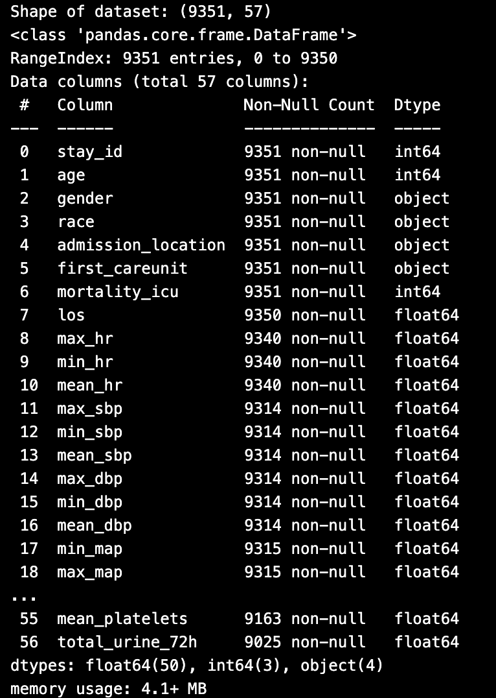
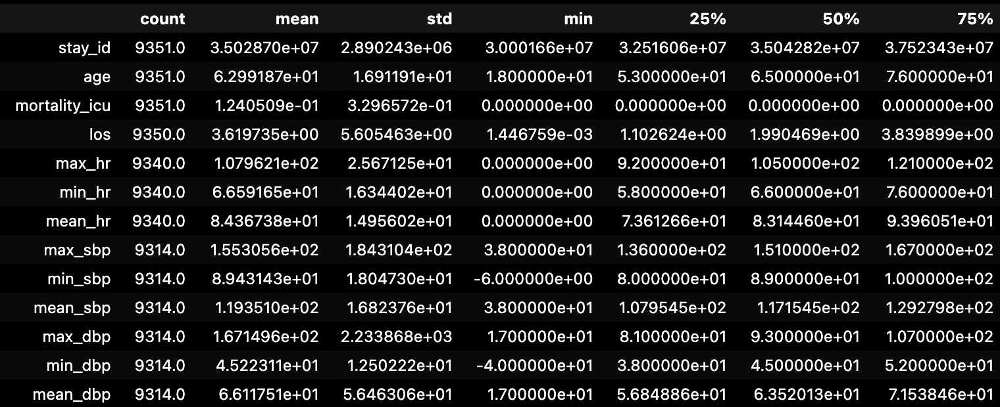

# Data Preview and Descriptive Summary

## 1. Features Kept for Data Preview (and Why)

### Demographics
- `age`
- `gender`
- `race`
- `first_careunit`

**Reason:** Provide patient-level context and baseline clinical risk factors.

### Outcome
- `hospital_expire_flag`

**Reason:** Target variable for ICU mortality prediction.

### Vital Signs (Mean Values – First 72h)
- `mean_hr`
- `mean_map`
- `mean_rr`
- `mean_spo2`
- `mean_sbp`
- `mean_dbp`

**Reason:** Mean values summarize physiological stability while avoiding redundancy from highly correlated min/max statistics.

### Key Laboratory Markers
- `max_lactate`
- `max_creatinine`
- `max_bilirubin`
- `max_bun`
- `max_wbc`
- `min_platelets`
- `mean_sodium`
- `mean_potassium`

**Reason:** Represent organ dysfunction and severity of illness using clinically meaningful summary statistics.

### Renal Function
- `total_urine_72h`

**Reason:** Indicator of kidney function and critical illness severity.

---

## 2. Descriptive Summary

- **Total ICU stays:** ~9,351  
- **Mortality rate:** ~12–15% (class imbalance present)  
- **Age distribution:** Majority between 55–75 years  
- **Length of Stay (LOS):** Right-skewed with long-tail outliers  
- **Vital Signs:** Non-survivors show higher HR and RR, lower blood pressure  
- **Laboratory Markers:** Non-survivors show elevated lactate, creatinine, bilirubin  
- **Missingness:** Higher in selected lab tests; minimal in vitals and demographics  

---

## 3. Example `.info()` Output

icu_df.info()

icu_df.describe()

---

# Data Quality Issues Identified

## 1. Missing Values

### Where it appears:
- High missingness: `max_pao2`, `max_fio2`, `max_bilirubin`, `max_lactate`
- Moderate missingness: `total_urine_72h`
- Minimal missingness: Most vital signs and demographics

### Magnitude:
- Some laboratory variables have >40–50% missing values.
- Most vital signs have <5% missingness.
- Demographic and outcome variables have 0% missingness.

### What it can mean:
- Certain labs are ordered selectively for sicker patients.
- Missingness may not be random and could carry clinical meaning.
- Imputation strategies must consider potential bias.

---

## 2. Class Imbalance

### Where it appears:
- Target variable: `hospital_expire_flag`

### Magnitude:
- Mortality rate ~12–15%
- Survivors significantly outnumber non-survivors.

### What it can mean:
- Models may bias toward predicting survival.
- Evaluation should use AUROC, F1-score, or class-weighting.

---

## 3. Outliers and Skewness

### Where it appears:
- `los` (Length of Stay) – heavily right-skewed.
- while analyzing vital vs mortality extreme outlier physiologically impossible values were seen. Scales were set accordingly for better visulaization.
- `max_lactate`, `max_creatinine`, `max_bun` – extreme high values.
- Some blood pressure and WBC values show extreme ranges.

### Magnitude:
- LOS shows long-tail distribution with extreme high values.
- Lab markers have extreme upper-range observations.

### What it can mean:
- Outliers may represent true severe cases.
- Log transformation may be necessary.
- Extreme values may influence model stability.

---

## 4. Multicollinearity

### Where it appears:
- High correlation between `mean`, `min`, and `max` versions of the same variable (e.g., creatinine, lactate, bilirubin, platelets).

### Magnitude:
- Several feature pairs show high correlation (|r| > 0.85).

### What it can mean:
- Redundant features increase model instability.
- Only one summary statistic per variable should be retained.

---

## 5. Standardization / Unit Handling

### Where it appears:
- Temperature required unit conversion (Fahrenheit to Celsius).
- FiO2 required normalization (percentage to fraction).

### What it can mean:
- Inconsistent units can distort feature scaling.
- Proper preprocessing is required before modeling.

---

# Questions for Stakeholders

1. Should missing laboratory tests be interpreted as normal, or as unmeasured due to lower clinical concern?
2. Are extreme lab values verified as clinically valid, or could they represent measurement errors?
3. Should LOS be used as a predictor, or does it risk data leakage?
4. Is ICU type intended to capture structural differences in care, or patient severity?
5. Should feature engineering prioritize worst-case values (max) or overall trends (mean)?

---

# Summary

The primary issues identified include missingness in selected lab variables, class imbalance, skewed distributions with outliers, and multicollinearity among derived features. These issues require careful preprocessing to ensure stable and interpretable modeling.

# Exploratory Analysis on 10% Sample

To perform faster exploratory analysis, 10% of the patient data was randomly sampled.

---

## 1. Features and Relationships Explored

The following relationships were investigated:

- Vital signs (HR, MAP, RR, SBP, DBP, SpO2) vs ICU mortality
- Laboratory markers (lactate, creatinine, bilirubin, BUN, WBC, platelets) vs ICU mortality
- Age vs mortality
- ICU type vs mortality
- Length of stay (LOS) distribution
- Correlations among derived summary statistics (mean/min/max)

---

## 2. Rationale for Variable Selection

Variables were selected based on:

- Clinical relevance to organ dysfunction
- Known association with critical illness severity
- Early physiological indicators within the first 72 hours
- Potential predictive value for ICU mortality

Vital signs capture hemodynamic and respiratory stability, while laboratory markers reflect organ failure (renal, hepatic, metabolic, inflammatory).

---

## 3. Initial Expectations

It was hypothesized that:

- Non-survivors would exhibit higher lactate, creatinine, bilirubin, and BUN levels.
- Non-survivors would show lower blood pressure and higher heart/respiratory rates.
- Advanced age would correlate with higher mortality.
- Mortality would differ by ICU type due to case mix.
- Length of stay would show strong right-skewness.

---

## 4. Key Findings from Visualizations

- Clear group separation for organ dysfunction markers (lactate, creatinine, bilirubin).
- Non-survivors demonstrated hemodynamic instability (higher HR/RR, lower MAP/SBP/DBP).
- Platelet counts were lower in non-survivors, suggesting coagulopathy.
- ICU types exhibited heterogeneous mortality rates.
- LOS distribution was heavily right-skewed with extreme outliers.

---

## 5. Nature and Strength of Relationships

- Relationships were generally monotonic but not strictly linear.
- Laboratory markers showed moderate-to-strong separation between groups.
- Vital sign differences were present but with overlapping distributions.
- Some associations may be nonlinear (e.g., extreme lab values disproportionately linked to mortality).

---

## 6. Group Differences and Patterns

- Distinct physiological profiles were observed between survivors and non-survivors.
- Certain ICU units demonstrated higher mortality rates, likely reflecting patient acuity.
- No distinct unsupervised clustering beyond mortality grouping was observed.

---

## 7. Redundancy and Multicollinearity

- Strong correlations were observed between mean/min/max summaries of the same variable.
- SBP, DBP, and MAP were highly interrelated.
- Redundant features were identified and reduced to prevent multicollinearity.

---

## 8. Unexpected Observations

- SpO2 showed weaker separation than anticipated.
- Sodium and potassium differences were modest.
- Some extreme LOS values were not directly associated with mortality.
- Certain ICU types had wide confidence intervals due to smaller sample sizes.

---

## 9. Contradictions to Hypothesis

No major contradictions were observed.  
However, overlap in some vital signs suggests that mortality cannot be explained by single variables alone and likely reflects multivariate physiological deterioration.

---

## 10. Interpretation

The exploratory analysis supports the hypothesis that early multi-organ dysfunction is associated with ICU mortality.The findings justify focusing on organ failure markers and hemodynamic instability in downstream modeling.
