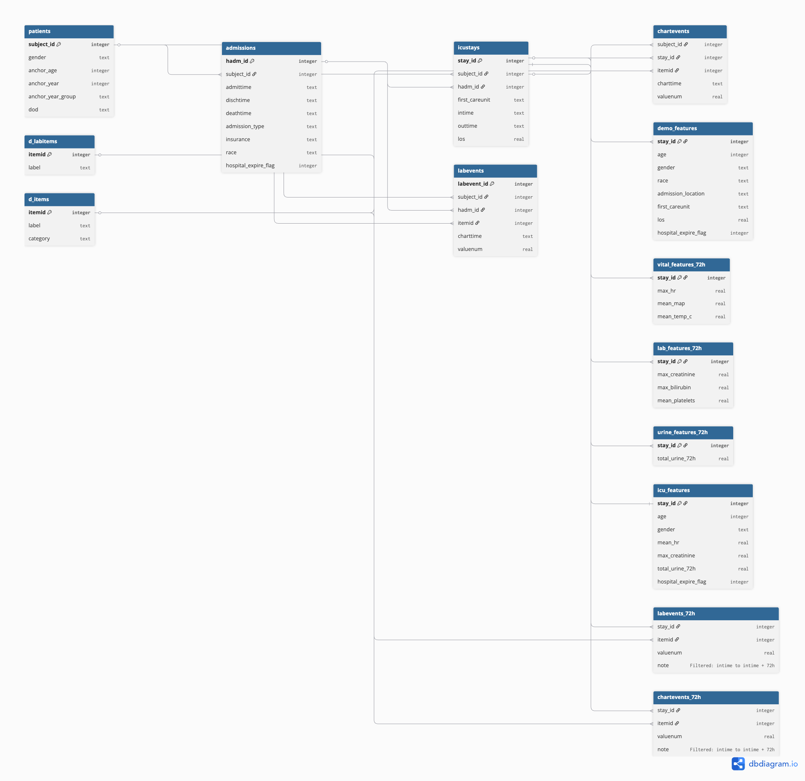

#### Author : Shesadree Priyadarshani
#### Date: 15th Feb 2026

# ICU Mortality Prediction Using First 72 Hours of MIMIC-IV Data

This project develops a data-driven approach to predict ICU mortality using clinical data collected within the first 72 hours of ICU admission from the MIMIC-IV database.

The workflow includes database design, feature engineering, exploratory analysis, and documentation for full reproducibility.

---

# Repository Structure

```
CAP5771_LILI1501/
│
├── diary/
│   ├── problem_formulation.txt
│   ├── data_acquisition.txt
│   ├── data_acquisition_II_database.txt
│   ├── data_exploration.txt
│   ├── reflection_and_next_steps.txt
│   ├── figures/
|       └── describe.png
|       └── info.png
|
├── database_schema.png
│   
├── data_dictionary.pdf
│
├── Milestone1.ipynb
│
├── db_instruction.md (see access instructions how to create)
│
├── requirements.txt
│
└── README.md
```

---

# 1. Problem Formulation

## Objective

Develop a predictive model to estimate the probability of ICU mortality using patient data from the first 72 hours of ICU admission.

## Problem Type

Binary classification.

## Inputs

Features derived within 72 hours of ICU admission:

- Demographics (age, gender, race, ICU type)
- Vital signs (heart rate, MAP, respiratory rate, SpO2, SBP, DBP)
- Laboratory markers (lactate, creatinine, bilirubin, BUN, WBC, platelets, sodium, potassium)
- Urine output (total over 72 hours)

## Output

- `hospital_expire_flag`
  - 0 → Survived
  - 1 → Died during hospital stay

## Time Horizon

All features are restricted to measurements within the first 72 hours of ICU admission to prevent data leakage.

---

# 2. Data Acquisition & Documentation

## Data Source

- Dataset: MIMIC-IV (Medical Information Mart for Intensive Care)
- Hosted on PhysioNet
- Credentialed access required

## Acquisition Process

1. Download CSV files from PhysioNet.
2. Create a local SQLite database (`mimic_iv.db`).
3. Load raw tables:
   - patients
   - admissions
   - icustays
   - chartevents
   - labevents
   - outputevents
4. Create filtered views for the first 72 hours:
   - chartevents_72h
   - labevents_72h
   - outputevents_72h
5. Aggregate features using SQL `GROUP BY stay_id`.
6. Merge into final modeling table: `icu_features`.

All steps are reproducible through SQL queries and Python scripts.

---

# 3. Data Acquisition II – Database Storage

- Database type: SQLite
- One row in final table represents one ICU stay.
- Relational keys used for joins:
  - `subject_id`
  - `hadm_id`
  - `stay_id`
  - `itemid`
- These identifiers are used for linking and aggregation but are not predictive features.

Database schema visualization is included in:

```
database_schema.png
```


---

# 4. Data Exploration

Exploratory analysis included:

- Mortality distribution (class imbalance identified ~12–15%)
- Age distribution (majority 55–75 years)
- Length of stay (right-skewed)
- Vital signs vs mortality (hemodynamic instability in non-survivors)
- Laboratory markers vs mortality (organ dysfunction patterns)
- Missingness analysis (higher in selected lab tests)
- Correlation matrix (high correlation among min/mean/max variants)

Key findings:

- Non-survivors showed elevated lactate, creatinine, bilirubin.
- Blood pressure was lower in non-survivors.
- Several derived features were highly correlated and reduced.

---

# 5. Reflection and Next Steps

## Identified Issues

- Class imbalance
- Missing laboratory data
- Multicollinearity among summary statistics
- Skewed distributions (LOS, lab markers)
- Potential outliers

## Next Steps

- Remove redundant features
- Apply missing value imputation
- Log-transform skewed variables
- Address class imbalance
- Build baseline logistic regression model
- Compare with tree-based models
- Evaluate using AUROC and precision-recall
- Analyze feature importance

---

# 6. Database Schema

The database schema diagram is included as:



It illustrates:

- Core relational tables
- Aggregation tables
- Final modeling table
- Foreign key relationships

---

# 7. Data Dictionary

The complete data dictionary is provided as:


It describes:

- Variable definitions
- Units of measurement
- Aggregation logic
- Source tables
- Role (identifier vs feature)

---

# 8. Code Implementation

The main implementation file:

```
Milestone1.ipynb
```

Includes:

- Problem formulation
- Data acquisition
- Database construction
- Feature engineering
- Data exploration

All processing is reproducible and programmatically executed.

---

# 9. Reproducing the Project

## Step 1 – Clone Repository

```bash
git clone <https://github.com/lili1501/CAP5771_lili1501.git>
cd CAP5771_LILI1501
```

## Step 2 – Create Environment

Using conda:

```bash
conda create -n icu_env python=3.10
conda activate icu_env
```

## Step 3 – Install Dependencies

```bash
pip install -r requirements.txt
```

---

# 10. Database File or Access Instructions

## Generate Database

1. Obtain credentialed access to MIMIC-IV via PhysioNet.
2. Download required CSV files.
3. Run the notebook or scripts to:
   - Load tables
   - Create filtered views
   - Generate aggregated feature tables
4. The database will be created locally as (see intruction in db_instruction):


mimic_iv.db
[db_instruction.md](db_instruction.md)


---

# 11. Dependencies

Listed in `requirements.txt` (Milestone1):

- pandas
- numpy
- matplotlib
- seaborn
- tqdm
- jupyter

SQLite is included in the Python standard library.

---

# Summary

This repository demonstrates:

- Structured relational database design
- Time-window feature engineering
- Clinical exploratory data analysis
- Reproducible modeling pipeline
- Complete documentation

All components are organized for clarity, reproducibility, and academic evaluation.
